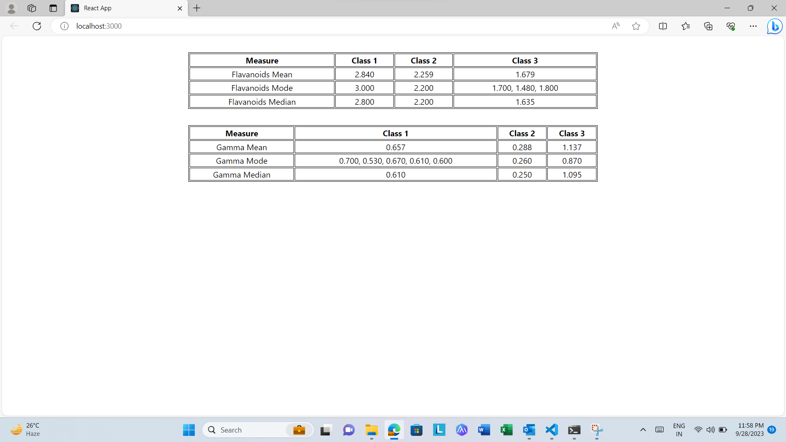

click the link to view the result

Start- to start the Project..open the terminal in command line or vscode and write yarn start

Some Details:

Created a Custom Function which will display Mean, Median & Mode for the particlar key in  Alcohol Json.
Didnt used any Array Methods...All the Calculation is Done by For, ForIn and Forof Loop.
Used Typescript.
The Fucntion is Purely Dynamic, If we have to calculate Mean, Median, Mode of any other Key, just pass the name in Function Argument.
Added Comment in Util Files to describe what particular code is doing.
